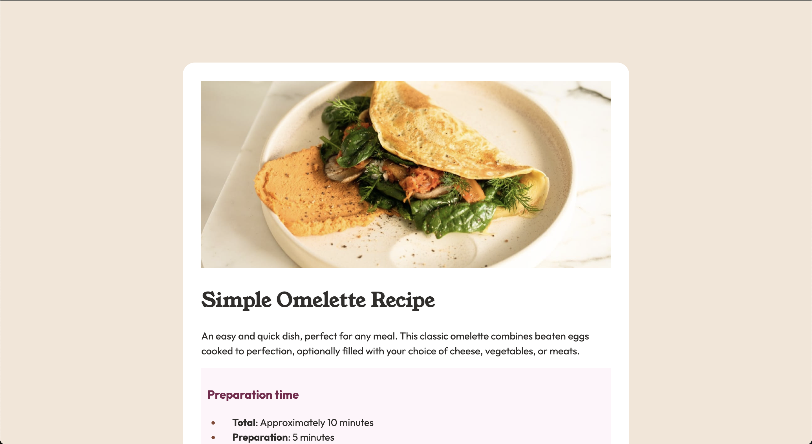

# Frontend Mentor - Recipe page solution

This is a solution to the [Recipe page challenge on Frontend Mentor](https://www.frontendmentor.io/challenges/recipe-page-KiTsR8QQKm). Frontend Mentor challenges help you improve your coding skills by building realistic projects.

## Table of contents

- [Overview](#overview)
  - [The challenge](#the-challenge)
  - [Screenshot](#screenshot)
  - [Links](#links)
- [My process](#my-process)
  - [Built with](#built-with)
  - [What I learned](#what-i-learned)
  - [Continued development](#continued-development)
- [Author](#author)

**Note: Delete this note and update the table of contents based on what sections you keep.**

## Overview

### Screenshot



### Links

- Solution URL: [GitHub](https://github.com/catreedle/recipe-page)
- Live Site URL: [Live Site](https://recipe-page-beta-sandy.vercel.app/)

## My process

### Built with

- Semantic HTML5 markup
- CSS custom properties
- Flexbox

### What I learned

I tried to implement semantic HTML for every part of this project. I learned to use table, an element I do not use a lot.

```html
<table>
  <tr>
    <td>Calories</td>
    <td class="column-two">277kcal</td>
  </tr>
  <tr>
    <td>Carbs</td>
    <td class="column-two">0g</td>
  </tr>
  <tr>
    <td>Protein</td>
    <td class="column-two">20g</td>
  </tr>
  <tr>
    <td>Fat</td>
    <td class="column-two">22g</td>
  </tr>
</table>
```

I also learned to style it, adding border in between rows, I struggled a bit here.

```css
tbody tr:not(:last-child) td {
  border-bottom: 1px solid var(--stone150); /* Adds bottom border to cells */
}
```

The borders had small gaps in between column, this differs from the design. I learned a new property to remove the gaps:

```css
table {
  border-collapse: collapse;
}
```

I also learned how to set color for the bullets and numbers in list element.

```css
ol li::marker,
ul li::marker {
  color: var(--brown800);
}
```

Overall, I enjoyed this challenge. I feel more comfortable writig web pages from scratch now.

### Continued development

I didn't write a lot of CSS classes in this project, I used element selector for the most part. Maybe I need to pay more attention in planning to style my elements in the next projects. I also need to learn about best practices in writing responsive page.

## Author

- Website - [Purnama S Rahayu](https://www.your-site.com)
- Frontend Mentor - [@catreedle](https://www.frontendmentor.io/profile/catreedle)